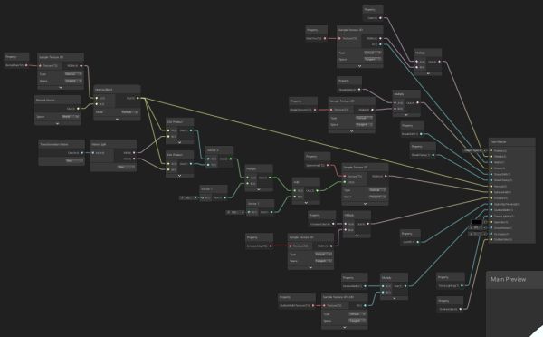
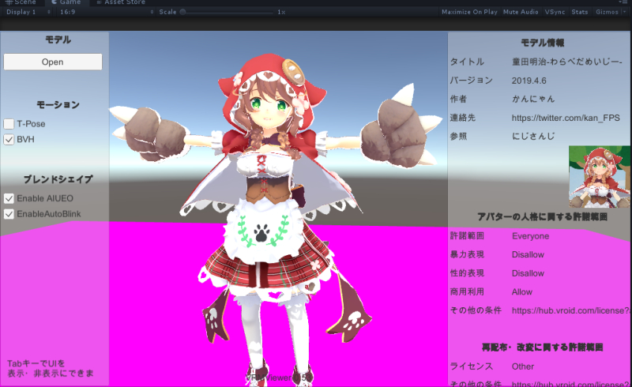

# LWRP Toon Shader for UniVRM(MToon)  

New URP Toon Shader -> https://github.com/simplestargame/SimpleURPToonLitOutlineExample

This repository is old.  
This shader does not support the latest UniVRM.



## Getting Started  

This project uses Unity 2019.1.11f1 or later.  

1. Import UniVRM and check Sample scenes.  
https://github.com/vrm-c/UniVRM/releases  
Play Assets/VRM.Samples/Scenes/SimpleViewer.unity  
Now, you can see [all vrm characters](https://hub.vroid.com/) with [MToon shader](https://github.com/Santarh/MToon).  
  
Good!

2. Install & setup packages for LWRP  
Window > Package Manager > Lightweight RP  
  
you can find Library\PackageCache\com.unity.render-pipelines.lightweight@5.16.1  
and com.unity.shadergraph@5.16.1  
move these 2 folders to Packages directory like "Packages\com.unity.~"  
set Project Settings > Graphics > Scriptable Render Pipeline Settings  
use Assets/Project/LWRP-HighQuality  
  
Wow!  

3. Replace Shader Files  
Override Packages\com.unity.render-pipelines.lightweight@x.xx.x\ShaderLibrary\Lighting.hlsl from Assets/Project/Lighting.hlsl  
Move 3 files from Assets/Project/Editor/Lightweight RP/* to Packages/Lightweight RP/Editor/ShaderGraph/  
Move 2 files from Assets/Project/Editor/Shader Graph/MasterNodes/* to Packages/Shader Graph/Editor/Data/MasterNodes/  
Move 1 files from Assets/Project/Editor/Shader Graph/ShaderGUI/* to Packages/Shader Graph/Editor/ShaderGUI/  
Move 1 files from Assets/Project/Editor/Shader Graph/Views/* to Packages/Shader Graph/Editor/Drawing/Views/  
Edit Assets\VRM\UniVRM\Scripts\Format\VRMMaterialImporter.cs as following  
```cs
var shaderName = "Shader Graphs/ToonShaderGraph";//item.shader;
var shader = Shader.Find(shaderName);
```
Now, you can retry load vrm files.  
  
Yeah!

# Detail  
Watch replaced files.
