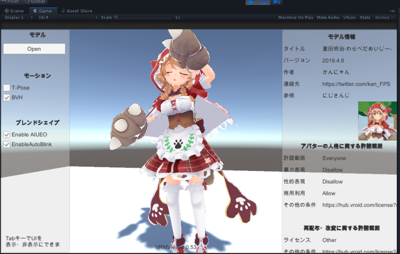
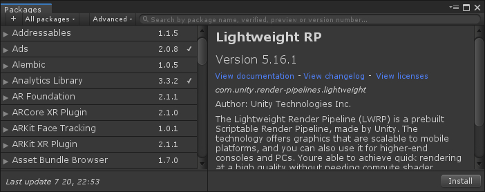
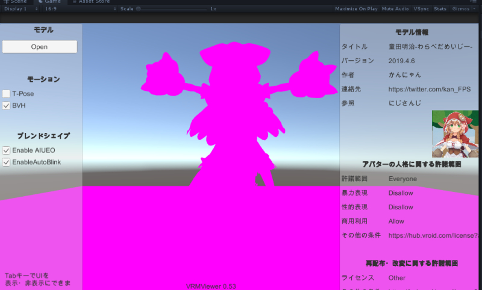

# LWRP Toon Shader for UniVRM(MToon)  

## Getting Started  

This project uses Unity 2019.1.11f1 or later.  

1. Import UniVRM and check Sample scenes.  
https://github.com/vrm-c/UniVRM/releases  
Play Assets/VRM.Samples/Scenes/SimpleViewer.unity  
Now, you can see [all vrm characters](https://hub.vroid.com/) with [MToon shader](https://github.com/Santarh/MToon).  
  
Good!

2. Install & setup packages for LWRP  
Window > Package Manager > Lightweight RP  
  
you can find Library\PackageCache\com.unity.render-pipelines.lightweight@5.16.1  
and com.unity.shadergraph@5.16.1  
move these 2 folders to Packages directory like "Packages\com.unity.~"  
set Project Settings > Graphics > Scriptable Render Pipeline Settings  
use Assets/Project/LWRP-HighQuality  
  
Good!  

3. Replace Shader Files  
Project View > Packages > Lightweight RP > ShaderLigrary  
Override Lighting assets from Assets/Project/Lighting  
Move 3 files from Assets/Project/Editor/Lightweight RP/* to Packages/Lightweight RP/Editor/Shader Graph  
